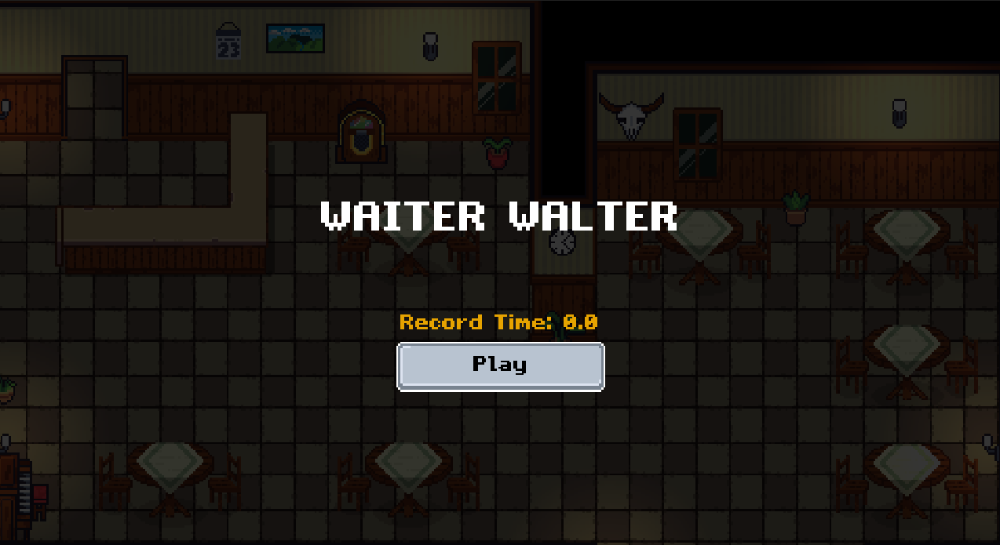
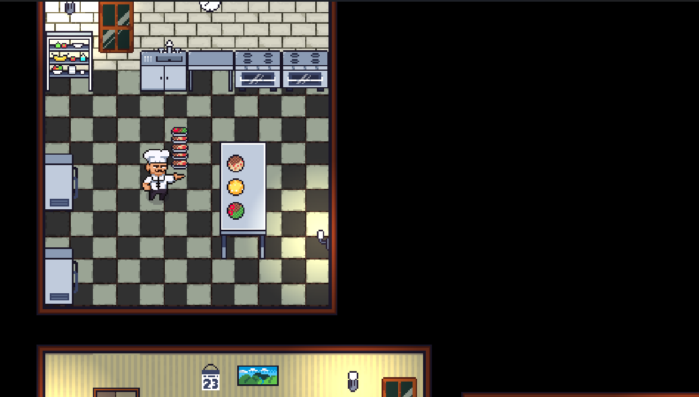
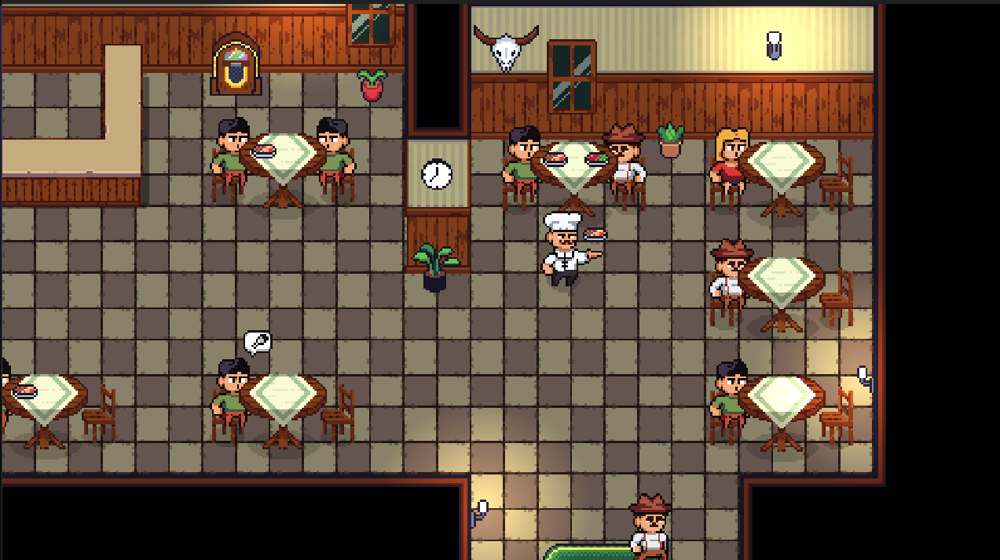

Creé un videojuego completo desde cero utilizando C# y .NET, aplicando de manera estratégica principios avanzados de programación orientada a objetos y patrones de diseño para garantizar una arquitectura escalable, mantenible y fácil de expandir.

Implementé buenas prácticas de ingeniería de software, un flujo de control de versiones profesional con Git y colaboración optimizada en GitHub, asegurando un desarrollo limpio, modular y altamente optimizado.

El resultado es una experiencia de juego fluida, inmersiva y robusta, que demuestra mi capacidad para fusionar creatividad, arquitectura de software y tecnologías modernas en un solo producto.

🎯 Pruébalo aquí: https://naujj.itch.io/waiter-walter

  
  
  

